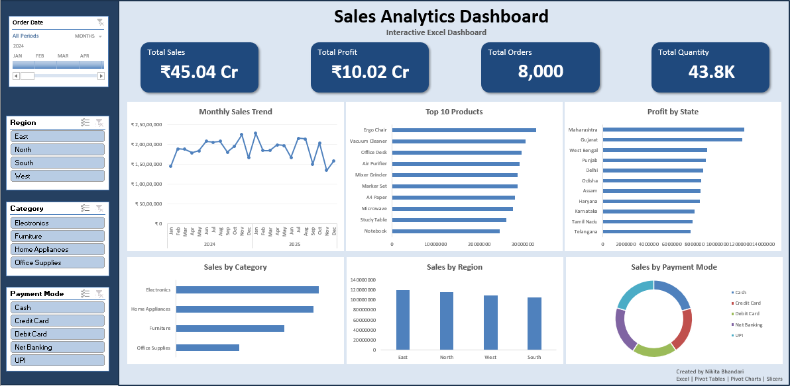

# 📊 Sales Analytics Dashboard (Microsoft Excel)

An interactive Sales Analytics Dashboard built in **Microsoft Excel** to analyze business performance across sales, profit, products, regions, states, payment methods, and time periods.

The dashboard leverages **Power Query**, **Pivot Tables**, **Pivot Charts**, **Slicers**, **Timeline**, and **Dynamic KPI Cards** to provide an interactive reporting experience.

---

## 📷 Dashboard Preview



---

## 🚀 Features

- 📈 Interactive Monthly Sales Trend
- 💰 Dynamic KPI Cards
  - Total Sales
  - Total Profit
  - Total Orders
  - Total Quantity
- 🌍 Sales Analysis by Region
- 🛍 Sales Analysis by Category
- 🏆 Top 10 Best-Selling Products
- 📍 Profit Analysis by State
- 💳 Sales by Payment Mode
- 🎛 Interactive Timeline and Slicers

---

## 🛠 Tools & Technologies

- Microsoft Excel
- Power Query
- Pivot Tables
- Pivot Charts
- Slicers
- Timeline
- GETPIVOTDATA
- Shapes & Dynamic KPI Cards

---

## 📊 Dashboard Insights

The dashboard enables users to:

- Monitor overall business performance
- Analyze monthly sales trends
- Compare sales across regions and categories
- Identify top-selling products
- Track state-wise profitability
- Understand customer payment preferences
- Filter reports dynamically using Timeline and Slicers

---

## 📁 Dataset

- Synthetic Sales Dataset
- **8,000+ Sales Records**
- Includes:
  - Order Date
  - Product
  - Category
  - Region
  - State
  - Sales
  - Profit
  - Quantity
  - Payment Mode

---

## ✨ Skills Demonstrated

- Data Cleaning using Power Query
- Data Transformation
- Pivot Table Analysis
- Interactive Dashboard Design
- KPI Reporting
- Business Intelligence Reporting
- Data Visualization
- Excel Automation
- Analytical Thinking

---

## ▶️ How to Use

1. Download **Dashboard.xlsx**
2. Open the workbook using Microsoft Excel (2019, 2021, or Microsoft 365 recommended).
3. Enable editing if prompted.
4. Use the Timeline and Slicers to interact with the dashboard.

---

## 📂 Repository Structure

```
sales-analytics-dashboard-excel/
│
├── Dashboard.xlsx
├── dashboard-preview.png
├── README.md
└── LICENSE
```

---

## 📌 Key Highlights

✔ Interactive Dashboard

✔ Dynamic KPI Cards

✔ Timeline Filtering

✔ Multi-level Slicers

✔ Business Performance Analysis

✔ Professional Dashboard Layout

---

## 👨‍💻 Author

**Nikita Bhandari**

- LinkedIn: https://www.linkedin.com/in/nikita-b-8b186a336
- GitHub: https://github.com/bhandari-nikita

---

## ⭐ If you found this project useful, consider giving it a Star!
